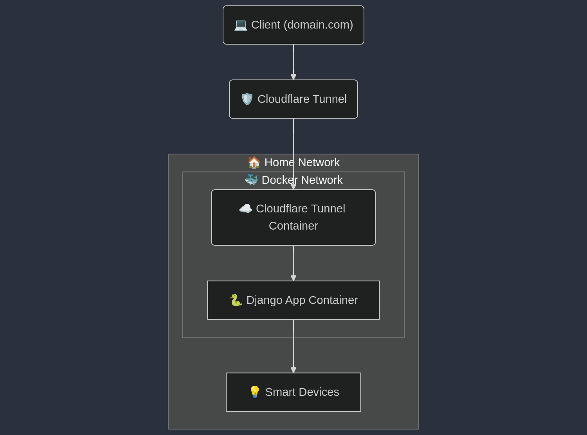

# Smart Home API
This is an API for managing smart home devices designed to work with Garmin and the app [HttpClient](https://apps.garmin.com/apps/da241207-e929-4cdf-9662-11ab17ffd70d).

For more information go to [wiki](https://github.com/mateuszbaranczyk/smart-home-api/wiki)

## Development
Prepare the environment by installing Poetry, then run `poetry install` and `poetry shell`. Change the directory to `/home_api`. To start Django, run `python3 manage.py runserver`.

## Tests
Run tes in `home_api` directory.
```bash
pytest
# for coverage
pytest --cov
```

## Deployment
Create a `.env` file in the root directory as follows:
```
SECRET_KEY=unsafe
CSRF_ORIGIN=http://localhost:8000
```
Create `docker-compose.yaml` and replace volume path. Here sqlite db will be saved.
```yaml
services:
  backend:
    container_name: garlight
    build: .
    env_file: .env
    network_mode: host
    volumes:
      - /your/path/to/database:/app/home_api/database

```

Before you build the Docker image, run:
```bash
python3 manage.py collectstatic
python3 manage.py makemigrations
python3 manage.py migrate
```
and then `docker compose up -d`.

Some Garmin models require an HTTPS connection. In this case, I am using a Cloudflare tunnel with forced HTTPS connection.

